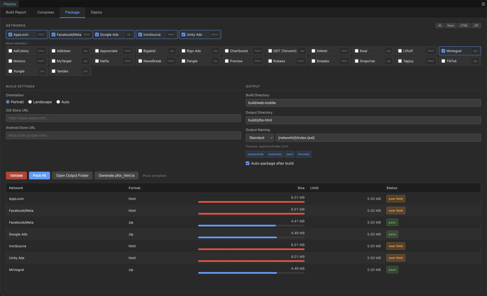

# Playbox — Cocos Creator Extension

[](https://www.cocos.com/en/creator)
[](#supported-networks)
[](https://github.com/playbox-org/plbx-cocos-assistant/blob/master/LICENSE)
[]()

**Playable development tools for Cocos Creator — packaging, validation, and asset compression for 30+ ad networks.**

**[README на русском](README_RU.md)** | **[中文 README](README_ZH.md)**



## Features

### 1. Ad Network Packaging — [30+ networks](#supported-networks)

Package your web-mobile build into a self-contained HTML or ZIP playable for each ad network in one click.

- **Select networks** — choose only the networks you need per project
- **Auto-generate adapter script** — generates `plbx_playable.ts` with network-specific CTA and lifecycle logic
- **Auto-detect build** — automatically picks up the latest Cocos Creator web-mobile build
- **Auto-package** — optionally re-package every time Cocos Creator finishes a build
- **Custom output naming** — template-based paths with `{networkId}`, `{ext}`, and custom variables
- **Cloud deploy** — upload packaged creatives directly to [Playbox Cloud](https://plbx.ai) for sharing and review

### 2. Build Validation

Test your packaged playable in a built-in browser preview with per-network SDK mocks and a validation checklist — without leaving Cocos Creator.

- **Network callback tracking** — monitors lifecycle events (gameReady, gameStart, gameEnd, gameClose) per network with pass/fail status
- **Axon Events tracking** (AppLovin) — extracts `trackEvent()` calls from your source and verifies they fire during preview
- **Device emulation** — iPhone, Pixel, Galaxy, iPad frames with orientation toggle
- **SDK mocks** — MRAID, DAPI, and network-specific CTA methods auto-injected
- **How-to-fix hints** — when a check fails, shows specific instructions and links to official validators

<video src="https://github.com/user-attachments/assets/7334bd5c-f90e-4b1b-b4cc-7bbdaaad8204" autoplay loop muted playsinline></video>

### 3. Build Report

Scan your project assets and see exactly what made it into the build — and what didn't.

- **Size breakdown** — Engine (cc.js), Plugins, Assets, Scripts, Other
- **Per-asset status** — confirmed in build, predicted, or unused
- **Packed HTML sizes** — see final size per network after packaging

### 4. Asset Compression

Compress images (WebP / JPEG / PNG / AVIF) and audio (MP3 / OGG) with live preview and quality controls before packaging.

<video src="https://github.com/user-attachments/assets/ab57c518-0f64-4809-a315-eb81109aa58a" autoplay loop muted playsinline></video>

## Supported Networks

| Network | Size Limit |
|---------|-----------|
| AppLovin | 5 MB |
| Unity Ads | 5 MB |
| ironSource | 5 MB |
| Facebook / Meta | 5 MB |
| Google Ads | 5 MB |
| Mintegral | 5 MB |
| TikTok / Pangle | 5 MB |
| Vungle | 5 MB |
| Liftoff | 5 MB |
| Moloco | 5 MB |
| Snapchat | 5 MB |
| Bigo Ads | 5 MB |
| GDT (Tencent) | 5 MB |
| Chartboost | 3 MB |
| Yandex | 3 MB |
| AdColony | 2 MB |
| MyTarget | 2 MB |
| Tapjoy | 1.9 MB |
| Appreciate | 5 MB |
| Smadex | 5 MB |
| Rubeex | 5 MB |
| Nefta | 5 MB |
| NewsBreak | 5 MB |
| Kwai | 5 MB |
| inMobi | 5 MB |
| Adikteev | 5 MB |
| Bigabid | 5 MB |

## How to Use

### 1. Build in Cocos Creator

Build your project as **web-mobile** in Cocos Creator. The extension will detect the build automatically.

### 2. Add the adapter script

Click **"Generate plbx_playable.ts"** in the Package tab. This creates `assets/Scripts/plbx_html/plbx_playable.ts` — a thin bridge that exposes network-agnostic methods to your game code:

```typescript
import plbx from './plbx_html/plbx_playable';

plbx.download();    // redirect to store (CTA)
plbx.game_end();    // notify ad network that gameplay ended
plbx.is_audio();    // check if audio is allowed
```

Call these methods in your game — the packager injects the correct network-specific implementation at build time.

### 3. Package

Select networks and click **Package**. The packager:

1. Takes your web-mobile build
2. Injects `window.plbx_html` (and `window.super_html` as an alias) with network-specific CTA and lifecycle routing
3. Produces self-contained HTML or ZIP output files

The `super_html` injection is fully automatic — every packaged build gets it regardless of network. Your game code stays network-agnostic; the packager handles all routing.

### 4. Validate

Open the **Package** tab, select a network, and click **Preview**. The built-in validator loads your playable in an iframe and checks:

- File size within network limit
- Game loads without errors
- CTA triggers correctly
- Lifecycle events fire in the right order
- No external network requests

## Installation

```bash
cd your-cocos-project/extensions
git clone https://github.com/playbox-org/plbx-cocos-assistant.git plbx-cocos-extension
cd plbx-cocos-extension
npm install
npm run build
```

Open Cocos Creator — the extension loads automatically. Open the panel via **Panel → Playbox**.

### Requirements

- Cocos Creator **3.8.0+**
- Node.js **18+**
- FFmpeg *(optional — required for audio compression)*

## Development

```bash
npm run build        # compile TypeScript
npm run watch        # watch mode
npm run test         # run tests (vitest)
npm run test:watch   # watch mode
```

To load the extension from source in Cocos Creator: open **Extension Manager**, click **Developer Import**, and select the extension folder.

## License

[Apache License 2.0](LICENSE)
